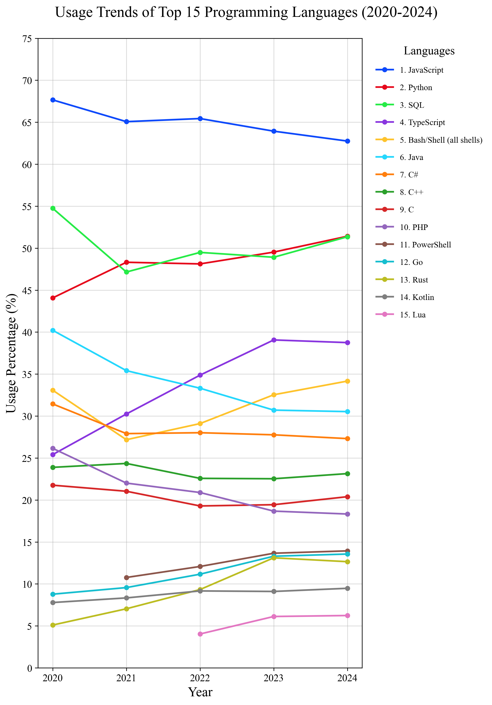
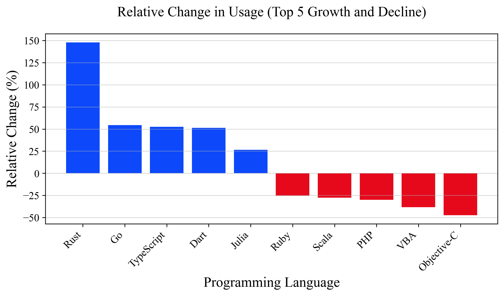

# Programming Language Trends in Stack Overflow Developer Surveys (2020–2024)

This project analyzes programming language popularity and developer preference
using data from the [Stack Overflow Developer Surveys](https://survey.stackoverflow.co/)
from 2020 to 2024.

The project was developed as part of my Grade 12 research paper into how
programming language popularity and developer preferences have changed over time.
It combines statistical analysis, trend analysis, and data visualization using Python.

## Research Question

**How have programming language popularity and developer preference changed between 2020 and 2024?**

### Sub-Questions

1. Which programming languages show consistent growth or decline in **Loved/Admired**, **Desired**, and **Usage** metrics between 2020 and 2024?
2. How do these shifts correlate with technical features, established ecosystems, or industry trends?
3. Why do established programming languages continue to maintain high usage despite the emergence of newer alternatives?

## Dataset

The analysis uses data from the [Stack Overflow Developer Surveys](https://survey.stackoverflow.co/).

The surveys provide information about developers' programming language usage and preferences, including metrics such as:

- **Loved/Admired:** the proportion of developers who have used a language and would like to continue using it.
- **Desired:** the proportion of developers who have not used a language but would like to use it.
- **Usage:** the proportion of developers who report using a language.

The raw Stack Overflow survey datasets are **not** included in this repository and must be downloaded separately from Stack Overflow.

## Methodology

- Descriptive statistics
- Trend analysis
- Visualization using Python

### Tools

Data processing, statistical analysis, and visualization are performed using:

- **Microsoft Excel**
- **Python**
  - NumPy
  - pandas
  - Matplotlib
- **Jupyter Notebook**

The analytical workflow, including data cleaning, metric calculations,
and visualization scripts, is documented in this repository.

## Selected Visualizations

The analysis produced a range of visualizations examining programming language
trends across the 2020–2024 period.

### Overall Trends



### Relative Change



## Repository Structure

```text
SO-language-trends-2020-2024/
├── figures/
│   ├── Gap_Bar_Charts/
│   ├── Individual_Language_Line_Charts/
│   │   ├── Desired/
│   │   ├── Loved_Admired/
│   │   └── Usage/
│   ├── Relative_Change_Bar_Charts/
│   └── Top_Languages_Trends_Line_Charts/
├── notebooks/
│   ├── analysis_original.ipynb
│   └── analysis.ipynb
├── src/
│   ├── __init__.py
│   ├── helpers.py
│   ├── metrics.py
│   └── plotting.py
├── .gitignore
└── README.md
```

### Directory Overview

| Directory    | Description                                                                    |
| ------------ | ------------------------------------------------------------------------------ |
| `figures/`   | Generated charts and visualizations used in the analysis                       |
| `notebooks/` | Jupyter notebooks containing the analysis workflow                             |
| `src/`       | Reusable Python modules for data processing, metric calculations, and plotting |

## Data Source & License

[Stack Overflow Developer Survey](https://survey.stackoverflow.co/)

This project uses data from the Stack Overflow Developer Survey,
which is made available under the **Open Database License (ODbL) v1.0:**
http://opendatacommons.org/licenses/odbl/1.0/.

This repository does not include the raw Stack Overflow Developer Survey data.
Data must be downloaded separately from Stack Overflow.

## Research Context

This project accompanies my Grade 12 research on programming language
popularity and developer preference. The analysis uses quantitative evidence
from the Stack Overflow Developer Surveys to identify changes in
programming language adoption and sentiment between 2020 and 2024.

The findings are interpreted alongside theoretical frameworks and existing literature
to explore possible factors influencing the rise, decline, and continued adoption of
different programming languages.
